# Project Architecture Overview

## High-Level Structure
The project is a Python-based trading analytics and execution platform leveraging DuckDB for efficient data processing. It follows clean architecture principles with separation of concerns:

### Key Directories/Modules
- **src/**: Core application
  - **domain/**: Business entities (e.g., market_data.py, symbol.py), services (e.g., technical calculator), repositories.
  - **application/**: Use cases (e.g., scan_market.py, sync_data.py), services (e.g., scanner_service.py), scanners (strategies like breakout_scanner.py, backtesting with backtester.py and optimization_engine.py), schedulers.
  - **infrastructure/**: Adapters (e.g., duckdb_adapter.py, broker_adapter.py for Dhan), config, core (database.py, api_server.py), external (data sync, realtime streamer, validators), logging, messaging (event_bus.py), observability, plugins (discovery and management).
  - **interfaces/**: API routes (health, market_data, scanners), CLI commands, static dashboard files (HTML/CSS/JS).
  - **presentation/**: Dashboard web app.

- **analytics/**: Dedicated analysis module
  - **core/**: DuckDB connector, pattern analyzer.
  - **dashboard/**: Web app for visualization.
  - **queries/**: SQL files (e.g., breakout_patterns.sql).
  - **rules/**: Rule engine with JSON configs.
  - **utils/**: Data processing and visualization tools.
  - **tests/**: Comprehensive unit/integration tests.

- Other: data/ (historical CSV-like files), database/, docs/, examples/, plugins/, sdk/, tests/.

## Key Components
1. **Data Layer**: Historical/live data sync via infrastructure/external/data_sync, stored in DuckDB (adapters and connectors).
2. **Analysis Layer**: Technical indicators, pattern analysis (analytics/core), rule engine for scanning.
3. **Strategy/Scanning Layer**: Backtesting (fast_backtester.py), optimization, strategies (e.g., relative_volume_scanner.py).
4. **Execution Layer**: Broker adapters (traderhull_broker.py), realtime streaming.
5. **UI/Interfaces**: API for programmatic access, CLI for operations, dashboard for monitoring.
6. **Extensibility**: Plugin system for custom components.
7. **Observability**: Logging, metrics, event bus.

## Architecture Diagram

```mermaid
graph TD
    subgraph External["External Systems"]
        DataSources[Data Sources<br/>Parquet Files]
        Brokers[Broker APIs<br/>Dhan Tradehull]
    end

    subgraph Infrastructure["Infrastructure Layer"]
        subgraph Adapters["Adapters"]
            DuckDBAdapter[DuckDB Adapter]
            BrokerAdapter[Broker Adapter]
        end
        subgraph Core["Core"]
            Database[DuckDB Database<br/>financial_data.duckdb]
            EventBus[Event Bus]
            Logging[Logging & Metrics]
            ConfigManager[ConfigManager<br/>YAML/ENV Validation]
        end
        subgraph ExternalInfra["External"]
            DataSync[Data Sync<br/>Historical/Live]
            RealtimeStreamer[Realtime Streamer]
            Plugins[Plugin System]
        end
    end

    subgraph Domain["Domain Layer"]
        subgraph Entities["Entities"]
            MarketData[MarketData<br/>OHLCV]
            Symbol[Symbol]
            Trading[Trading]
        end
        subgraph Services["Services"]
            TechnicalCalc[TechnicalIndicatorsCalculator]
            DataSyncService[DataSyncService]
        end
        subgraph Repositories["Repositories"]
            MarketRepo[DuckDBMarketDataRepository]
        end
    end

    subgraph Application["Application Layer"]
        subgraph UseCases["Use Cases"]
            ScanMarket[ScanMarketUseCase]
            SyncData[SyncDataUseCase]
            GenerateReport[GenerateReportUseCase]
        end
        subgraph Scanners["Scanners"]
            BaseScanner[BaseScanner ABC]
            BreakoutScanner[BreakoutScanner]
            TechnicalScanner[TechnicalScanner]
            Backtester[Backtester<br/>Optimization]
        end
        subgraph Services["Services"]
            ScannerService[ScannerService]
            NotificationService[NotificationService]
        end
    end

    subgraph Analytics["Analytics Module"]
        DuckDBAnalytics[DuckDBAnalytics]
        PatternAnalyzer[PatternAnalyzer]
        RuleEngine[RuleEngine]
        Dashboard[Dashboard App]
    end

    subgraph Interfaces["Interfaces Layer"]
        subgraph API["API"]
            App[FastAPI App]
            Routes[Routes:<br/>Health, MarketData,<br/>Scanners, Plugins]
        end
        subgraph CLI["CLI"]
            Main[CLI Main]
            Commands[Commands:<br/>Config, Data,<br/>Scanners, System]
        end
        subgraph Presentation["Presentation"]
            StaticFiles[Static Files<br/>HTML/CSS/JS]
            DashboardWeb[Dashboard Web App]
        end
    end

    %% Data Flow
    DataSources --> DataSync
    Brokers --> BrokerAdapter
    DataSync --> DuckDBAdapter
    RealtimeStreamer --> DuckDBAdapter
    DuckDBAdapter --> Database
    BrokerAdapter --> Brokers

    MarketRepo -.-> DuckDBAdapter
    TechnicalCalc -.-> MarketRepo
    DataSyncService -.-> DataSync

    ScanMarket --> BaseScanner
    ScanMarket --> TechnicalCalc
    ScannerService --> BreakoutScanner
    Backtester --> TechnicalCalc
    GenerateReport --> PatternAnalyzer

    DuckDBAnalytics --> Database
    PatternAnalyzer --> DuckDBAnalytics
    RuleEngine --> PatternAnalyzer
    Dashboard --> DuckDBAnalytics

    App --> ScanMarket
    App --> MarketRepo
    Main --> ScanMarket
    DashboardWeb --> Dashboard

    EventBus <--> ScanMarket
    EventBus <--> ScannerService
    Logging <--> AllLayers[All Components]
    Plugins <--> Scanners
    Plugins <--> Services
    ConfigManager -.-> Database
    ConfigManager -.-> BrokerAdapter
    ConfigManager -.-> BaseScanner
    ConfigManager -.-> TechnicalCalc

    classDef external fill:#e1f5fe
    classDef infrastructure fill:#f3e5f5
    classDef domain fill:#e8f5e8
    classDef application fill:#fff3e0
    classDef analytics fill:#fce4ec
    classDef interfaces fill:#f1f8e9

    class External,DataSources,Brokers external
    class Infrastructure,Adapters,Core,ExternalInfra infrastructure
    class Domain,Entities,Services,Repositories domain
    class Application,UseCases,Scanners,Services application
    class Analytics,DuckDBAnalytics,PatternAnalyzer,RuleEngine,Dashboard analytics
    class Interfaces,API,CLI,Presentation,App,Routes,Main,Commands,StaticFiles,DashboardWeb interfaces
```

## Data Flow
1. **Data Ingestion**: External data sources → Data Sync → DuckDB Adapter → Database
2. **Domain Processing**: MarketRepo retrieves data → TechnicalCalc computes indicators → Entities validate
3. **Application Logic**: ScanMarketUseCase orchestrates → Scanners analyze → Services process results
4. **Analytics**: DuckDBAnalytics queries → PatternAnalyzer discovers patterns → RuleEngine evaluates
5. **Interfaces**: API/CLI/Dashboard consume results → EventBus publishes events → Plugins extend functionality
6. **Execution**: ScannerService → BrokerAdapter → External Brokers for trade execution

## Dependencies & Relationships
- **Loose Coupling**: Scanners depend on domain repositories/services, not direct analytics imports
- **Dependency Injection**: Use cases inject repositories and services
- **Event-Driven**: EventBus decouples components (e.g., scan completion events)
- **Repository Pattern**: DuckDBMarketDataRepository abstracts data access
- **Strategy Pattern**: Scanner strategies registered dynamically in use cases
- **Plugin Architecture**: Extensible via plugin system in infrastructure

## Code Definitions & Integration
- **Domain Entities**: [`OHLCV`](src/domain/entities/market_data.py:11), [`MarketData`](src/domain/entities/market_data.py:38), [`MarketDataBatch`](src/domain/entities/market_data.py:69) with validation.
- **Technical Analysis**: [`TechnicalIndicatorsCalculator`](src/domain/services/technical/calculator.py:39) computes 50+ indicators using pandas_ta/TA-Lib with fallbacks.
- **Analytics Core**: [`DuckDBAnalytics`](analytics/core/duckdb_connector.py:17) for querying, [`PatternAnalyzer`](analytics/core/pattern_analyzer.py:44) for breakout discovery.
- **Scanners**: [`BreakoutScanner`](src/application/scanners/strategies/breakout_scanner.py:14) inherits [`BaseScanner`](src/application/scanners/base_scanner.py:19), uses SQL via infrastructure.
- **Use Cases**: [`ScanMarketUseCase`](src/application/use_cases/scan_market.py:48) orchestrates via registry, injects domain repos/services.
- **Repositories**: [`DuckDBMarketDataRepository`](src/infrastructure/repositories/duckdb_market_repo.py:17) implements domain interface using adapters.

## DuckDB Integration
DuckDB serves as the OLAP engine for querying Parquet files directly (via [`parquet_scan`](analytics/core/duckdb_connector.py:109)), with connections in adapters/core. Centralized in infrastructure, used by analytics and scanners via repos. Supports realtime/historical data without full ETL.

This architecture enables modular trading system with efficient analytics on financial data.